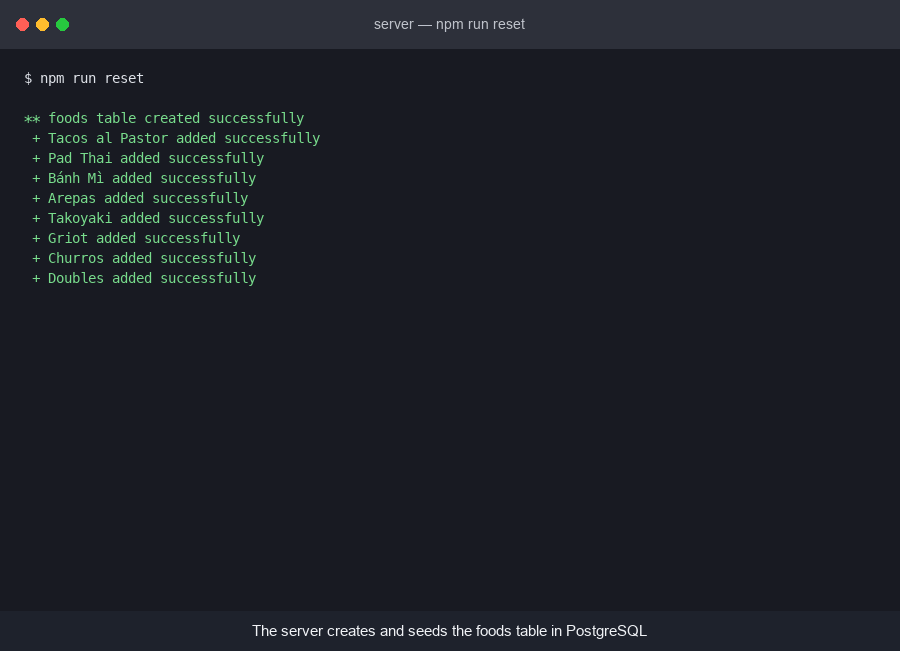

# WEB103 Project 2 - *Street Eats*

Submitted by: **Dhimy Jean**

About this web app: **Street Eats is a listicle of iconic street foods from around the world. It is the Project 1 app refactored so that nothing is hardcoded anymore: every dish now lives in a `foods` table in a Render PostgreSQL database. The Express server creates and seeds that table on startup, exposes it at `/api/foods` and `/api/foods/:slug`, and the vanilla HTML/CSS/JS frontend renders whatever the database returns. Adding a dish is now a row, not a code change.**

Time spent: **5** hours

## Required Features

The following **required** functionality is completed:

<!-- Make sure to check off completed functionality below -->
- [x] **The web app uses only HTML, CSS, and JavaScript without a frontend framework**
- [x] **Data is supplied to the app using a Render PostgreSQL database**
  - [x] **The web app is connected to a Render PostgreSQL database**
  - [x] **The database contains an appropriately structured table for the list items**

The following **optional** features are implemented:

- [x] Users can search for items with a specific attribute

The following **additional** features are implemented:

- [x] Detail pages keep their readable slug URLs (`/foods/griot`), with the slug stored as a `UNIQUE` column in the table
- [x] The page route checks the database before responding, so a dish that isn't in the table gets a real `404` instead of an empty detail page
- [x] SQL queries alias the lowercased Postgres columns back to camelCase (`priceRange`, `spiceLevel`, `whereToTry`), so the frontend from Project 1 works unchanged
- [x] All inserts and lookups are parameterized queries, so nothing is built by string concatenation
- [x] `npm start` reseeds the database and then starts the server, so the app and the data can never drift apart

## Video Walkthrough

Here's a walkthrough of implemented required features:



GIF created with headless Google Chrome screenshots stitched together with Python (Pillow) — see `scripts/make-walkthrough.py`

## Database

The `foods` table:

| attribute   | type         | notes                   |
| ----------- | ------------ | ----------------------- |
| id          | SERIAL       | primary key             |
| slug        | VARCHAR(255) | unique, used in the URL |
| name        | VARCHAR(255) |                         |
| country     | VARCHAR(255) |                         |
| city        | VARCHAR(255) |                         |
| category    | VARCHAR(255) |                         |
| priceRange  | VARCHAR(10)  |                         |
| spiceLevel  | VARCHAR(50)  |                         |
| image       | VARCHAR(255) |                         |
| description | TEXT         |                         |
| whereToTry  | TEXT         |                         |

## Project structure

- `client/` — the frontend (Vite, vanilla HTML/CSS/JS, Picocss), runs at http://localhost:3000
- `server/` — the Express backend, runs at http://localhost:3001
  - `config/database.js` — the `pg` connection pool
  - `config/dotenv.js` — loads `server/.env`
  - `config/reset.js` — creates the `foods` table and seeds it from `data/foods.js`
  - `controllers/foods.js` — the SQL queries behind each route
  - `routes/foods.js` — `/api/foods`, `/api/foods/:slug`, and `/foods/:slug`

## Running it locally

Create a PostgreSQL instance on [Render](https://render.com), then copy `server/.env.example` to `server/.env` and fill in the values from the database's **Connections** panel (use the external hostname, `{Hostname}.oregon-postgres.render.com`).

```bash
cd server
npm install
npm start
```

```bash
cd client
npm install
npm run dev
```

Then open http://localhost:3000.

`npm start` runs `npm run reset` first, which drops and recreates the `foods` table and reseeds it. To reseed without starting the server, run `npm run reset` on its own.

## Notes

The biggest gotcha was column casing. Postgres folds unquoted identifiers to lowercase, so `priceRange` comes back as `pricerange` and the Project 1 frontend quietly rendered `undefined`. Rather than rename things in the frontend, the controller aliases the columns in the `SELECT` (`priceRange AS "priceRange"`), which keeps the shape of the API identical to Project 1.

The other change worth calling out is the page route. In Project 1 it searched an in-memory array to decide between the detail page and the 404 page; it now asks the database instead, so the 404 behavior still works with data it has never seen.

## License

Copyright 2026 Dhimy Jean

Licensed under the Apache License, Version 2.0 (the "License"); you may not use this file except in compliance with the License. You may obtain a copy of the License at

> http://www.apache.org/licenses/LICENSE-2.0

Unless required by applicable law or agreed to in writing, software distributed under the License is distributed on an "AS IS" BASIS, WITHOUT WARRANTIES OR CONDITIONS OF ANY KIND, either express or implied. See the License for the specific language governing permissions and limitations under the License.
